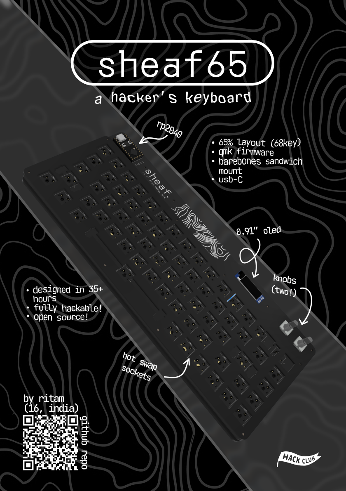
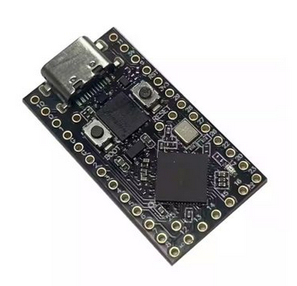
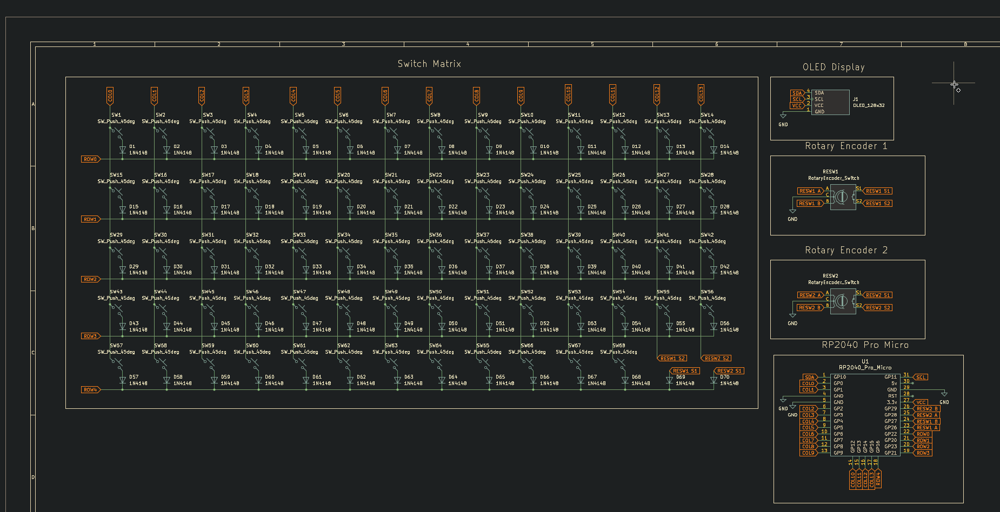
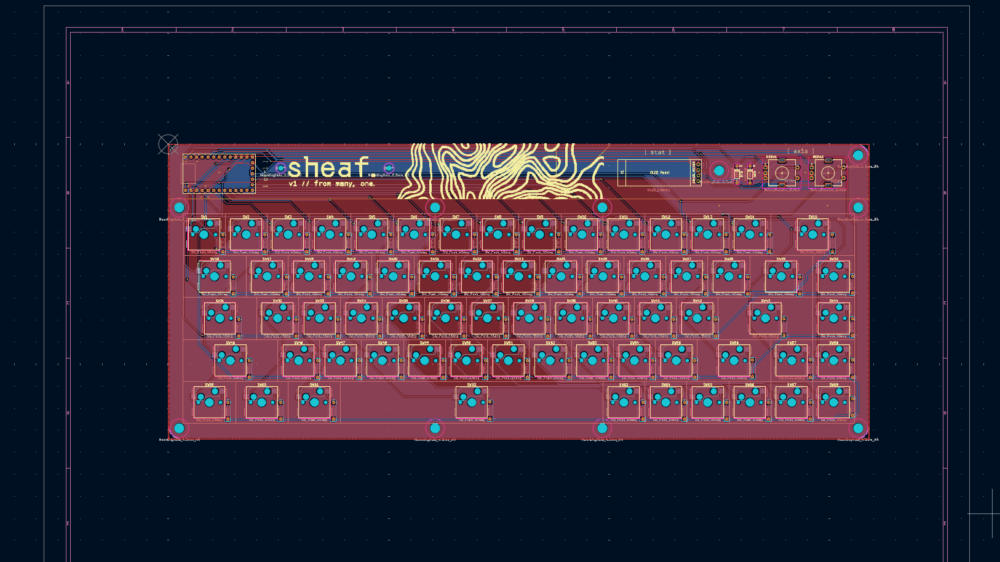
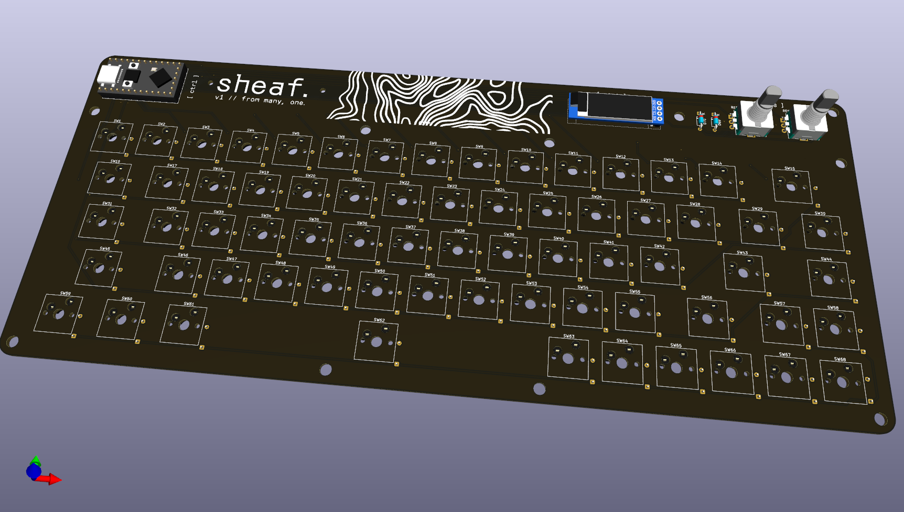
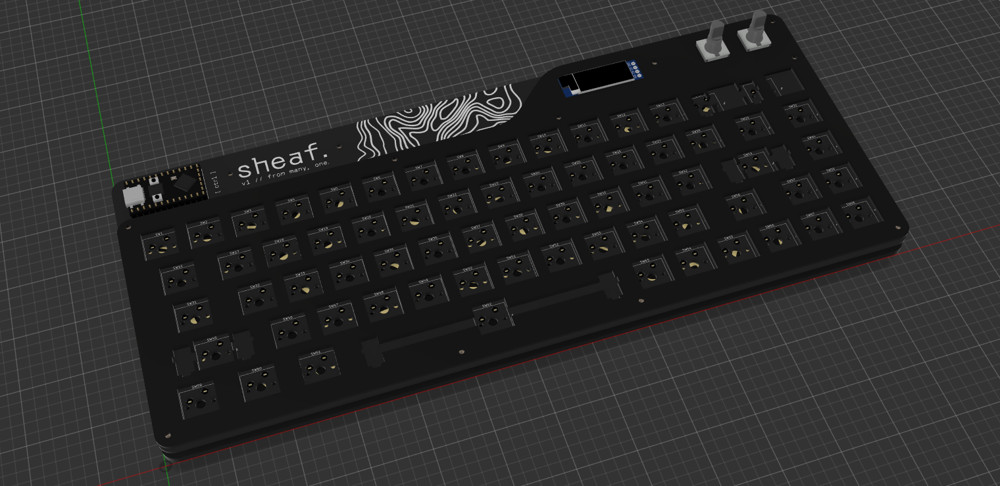

# sheaf65 🌊

A barebones, hackable, opinionated, ansi 65% layout  keyboard. The `Backspace` key and the `Grave` key swapped due to personal preferences.

The Keyboard is designed to be very bare bones and it is basically 3 layers - The switchplate (top), The PCB (Middle),
and The Backplate (Bottom) - kind of like a sandwich mounted keyboard.

The switchplate ("plate") and the backplate are to be 3D printed and engineered.
The whole "sandwich" is held together with 10 M2x10mm brass spacers and one M2x6mm brass spacer.

I also took the liberty to add two knobs and an OLED display to the keyboard because... why not?

## TL;DR for busy people

A simple, hackable 65% keyboard
1. RP2040-powered
2. Fully Hotswap (TTC Pokayoke V2)
3. 0.91" OLED Screen
4. Dual Rotary Encoders (Knobs)
5. QMK firmware (VIA soon)
6. Sandwich Mounted (3-stacked-layer)

Built because I wanted something fun and unique... with knobs.

## Why?
I wanted a nice keyboard, and decided that making one for myself would be a fun challenge to pursue.
I wanted a unique yet sleek looking keyboard that somewhat resembles the idea of a through hole keybaord kit minus the ugly visible diodes.
Also, no such THT keyboard kit did hotswap sockets (I know the sockets are SMD but you get me) so there's that.

## Microcontroller / Devboard
I used an Generic ProMicro RP2040 chip which is basically an Pi RP2040 in a somewhat a ProMicro layout, I found it on robu and I thought it was perfect so I went with it!. 

The devboard is THT soldered and mounted onto the keyboard, in full display, sort of like nibble65 keyboard but horizontal.

## The PCB

The PCB was made in the best software ever (for legal reasons that's a joke) called **KiCad**, it was straightforward enough but I think a good software helps a ton! Also, I'm taking on SMD soldering by including TTC Pokayoke hotswap sockets in this!

Here are some screenshots:

| What               | Image                               |
|--------------------|-------------------------------------|
| Schematic          | |
| PCB (B.silk hidden)|             |
| PCB 3D Model       ||

## The "Case"

I designed the case in Autodesk Fusion (formerly Fusion360) - good software!
The case is not really a case, its just two plates, one backplate and one switchplate

| What               | Image                                        |
|--------------------|----------------------------------------------|
| CAD Assembly       | |

## WTF is that design? (Design Credits + more)

The inspiration for this kind of keyboard case (or the whole thing in general) comes from though-hole keyboard kits like:
- mercuito40 (for the switchplate and mounting)
- gingham65 (mounting)
- nibble65 (embracing the exposed MCU design)
- my wack brain (for two knobs)
- also thanks to [somepin](https://www.printables.com/@somepin) for the [3d printed keyboard feet](https://www.printables.com/model/876658-mechanical-keyboard-cone-feet/files)
- **Honorable mention:**
>*reviewer (#fallout-checkpoint): ...I also think this would look sick with under glow... maybe consider that*
>Yeah no, the keyboard was NoRGB by choice, I like NoRGB setups

However, I didn't really like the exposed ugly diodes on the top, so I opted for a neat silkscreen instead which I designed in **Figma** (I know it isnt the correct tool for the job but whatever really)

> (find the custom silkscreen footprints [here](./kicad/footprints/art.pretty/))

## Keyboard Parts

Straightforward really, the switches, keycaps - they're all personal preference, so, heres my preference:

1. **Switches**: Nothing really beats the **Keygeek x MZ Y3 Linear Switches** for me, they're the perfect mix of thock (not as much as the Y2) and just enough creamy sound
2. **Keycaps**: PBT Clone Keycaps, nothing technical here, just Cherry Profile because I'm boring.
3. **Stabilizers**: i may have cheaped out, but the **Durock Plate-Mount Stabilizers** will work out for me.
4. **Hotswap**: The PCB is designed for TTC Pokayoke V2 hotswap sockets, so customizability is infinite!
5. **The "Case"**: The Hardware/CAD directory has both KeyboardPlate and Backplate STEP files, with their _3DP suffixed variants which are meant for 3D printing as they are filleted.

But really though, switches and keycaps are very personal and well, I can't really decide for you but all I can say is that I saw a thousand videos before settline on what I did.

## Firmware

Nothing too fancy here, just QMK (I fought with qmk for HOURS)

I plan to add VIA support soon :tm:

## The BOM

I would create a markdown table but I'm lazy... full breakdown in
[bom.csv here](./Hardware/bom/bom.csv)

> Costs \~₹10619 (~$114)

Somehow the BOM was fun to write!

## How to build it IRL

1. Spend some $$$ to get the parts from the BOM
2. Get your PCB fabricated and case 3D printed or machined (if 3D printing use the _3DP suffixed CAD files)
3. Solder Hotswap sockets on the back of the PCB and the through hole diodes too.
4. Solder header pins onto the MCU and that onto the PCB
5. Secure the 6mm stanoffs onto the countersunk holes on the backplate and the 10mm standoffs on the rest of the holes
6. Connect your switches to the plate and PCB
7. Slide the PCB into the standoffs and secure the plate with screws.

## License
The hardware (PCB, CAD Parts, Footprints) are licensed under `CERN Open Hardware Licence Version 2 - Strongly Reciprocal` 
which means, you're all-right to copy my work and use it in yours but you must disclose your source code and project files to opensource platforms if you use my work. See [LICENSE](LICENSE)

Firmware is QMK so, it is licensed under `GNU General Public License v2` (see [LICENSE-GPL](LICENSE-GPL))